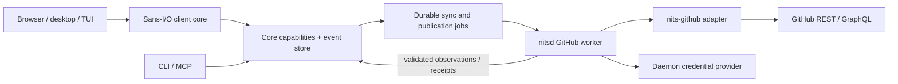
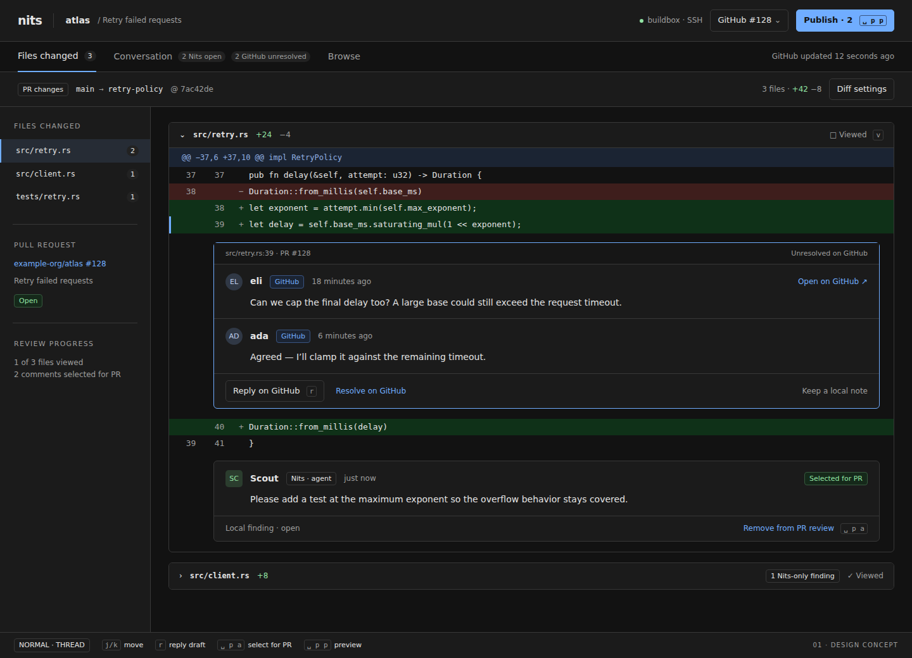
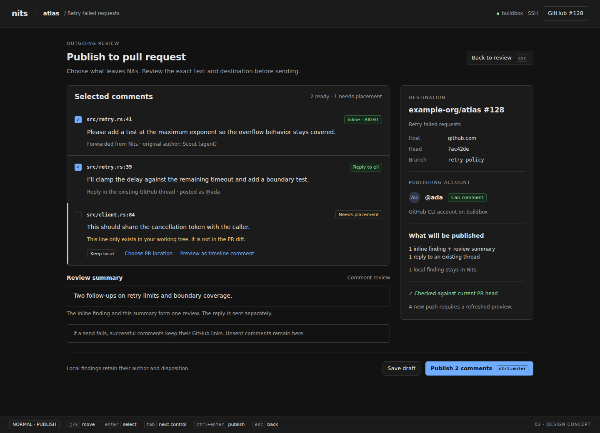
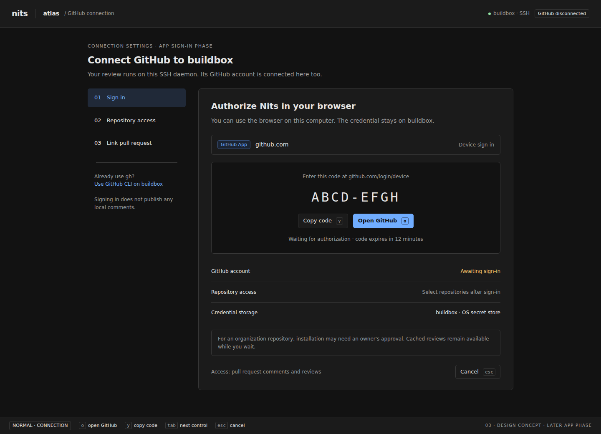

# Proposal: GitHub pull requests in Nits

Design proposal for [issue #49](https://github.com/JonoPrest/nits/issues/49).
Prepared 2026-09-18 against repository revision `dfd4a24`. This is a proposed
milestone, not implemented behavior or a change to the current roadmap.

## Recommendation

**Make a pull request a linked source of conversations and an explicit publishing
destination for a Nits review.** Import GitHub conversations automatically after
linking; keep new Nits comments local until someone selects them for publication.
Read and reply in the same inline thread, with source and delivery state visible.

Ship the complete read → review locally → select → preview → publish → receive
replies loop. An import-only release is a useful intermediate milestone, but does
not complete #49. Start with the existing GitHub CLI account on the daemon machine;
add a Nits GitHub App with device authorization for a self-contained sign-in flow.
Keep networking, credentials, polling and publishing beside the daemon.

The main choices are:

| Question | Proposed decision |
| --- | --- |
| What appears in Nits? | Inline/file review threads, PR conversation comments, submitted review summaries and review state. |
| What is sent to GitHub? | Only an explicitly selected, previewed set of comments/replies/actions. |
| Are both sides editable? | GitHub owns imported content; Nits owns local content. Publishing creates a tracked relationship, not silent two-way last-write-wins. |
| How does auth work initially? | Explicitly connect a particular host/account from `gh` on the daemon machine; optional fine-grained PAT for environments without `gh`. |
| Long-term auth? | GitHub App user access tokens via device flow, with selected-repository installation and secure daemon-side storage. |
| Polling or webhooks? | One daemon poller per linked PR/account, manual refresh, and refresh after writes. No public service required. |
| How do anchors work? | Retain GitHub coordinates and revision evidence; map to verified Nits blobs. Never invent a position when mapping is uncertain. |
| What stays separate? | Local finding disposition, GitHub thread resolution, PR approval, Nits checkpoints and human viewed marks. |

## 1. User journeys and boundaries

### Open or link a PR

From the review list, choose **Open pull request** and enter a URL or select a PR
for an attached repository. From an existing review, choose **Link pull request**.
Show host, base repository, PR number/title, head fork/branch, authenticated account
and local target before linking. Discovery may suggest a matching PR; it must not
silently associate one when branches, forks or remotes are ambiguous.

A PR opened as a new review uses its merge-base-to-head comparison. Fetch the
necessary objects into Nits-owned refs without checking out a branch, changing the
index or touching uncommitted work. Linking an existing review preserves its
targets and marks differences from the PR scope. The user can switch to **PR
changes** or continue with their local/working-tree scope.

### Review, then publish

GitHub threads appear beneath their code locations using the existing inline
cards. The Conversation tab contains both local and imported discussion. A local
finding initially says **Nits only**. **Add to PR review** selects it for an
outgoing draft; selection itself performs no GitHub write.

**Publish to PR** opens a preview showing account, destination, exact head,
selected bodies, placement and any attribution. Publish eligible inline roots as
one GitHub comment review where possible. File comments, replies and timeline
comments may require separate operations; expose partial success per item.

Replies to an imported thread use the same composer, labeled **Reply on GitHub**.
Submitting saves a local outgoing draft; the send/preview action is explicitly
**Send reply to GitHub**, rather than the existing local reply button gaining an
unexpected external side effect. A separate **Keep a local note** action creates
a local discussion linked to that thread, without injecting private text into the
remote conversation. CLI/MCP can preview and publish directly using the same Core
operations.

### Initial scope

The first complete release supports github.com, local and SSH daemons, browser,
desktop, CLI and MCP, existing checkouts, private repositories, fork PRs, outdated
threads and explicit publishing. GitHub Enterprise Server support is designed
into host identity but follows a tested version/capability matrix. Approval and
request-changes submission, remote edits/deletion and app sign-in are subsequent
milestones. PR creation, pushing branches, merging, CI management, cross-machine
Nits replication and automatic agent publishing are separate projects.

## 2. Association and revision identity

Use `(GitHubHost, GitHubRepositoryId, PullRequestNumber)` as durable identity, with
node IDs where required by GraphQL. Owner/name and URLs are display/routing data:
refresh them after renames or transfers without treating a different repository
at the old slug as the same one. Bind an account by immutable user ID, not login.

An association belongs to `(ReviewId, RepoId)`, not the whole workspace. Initially
allow one active PR per review target, and multiple targets with distinct PRs in
one review. A review-level comment must choose a destination explicitly in a
multi-PR review. Selecting several destinations creates separate publication
plans and receipts; there is no cross-PR atomicity. A PR may be linked to several
Nits reviews; share the remote mirror and fan out projections without duplicate
polling or publication.

Capture a `PullRequestRevision` containing base tip, head commit, verified merge
base, resolved trees and the observation generation. PR comparison must not reuse
an arbitrary local `main` tip or the synthetic test-merge commit. Retain fetched
commits under Nits-owned refs using the existing revision-retention machinery.
Record each observation so historical thread context can be reopened after a
force push. Failed or shallow fetches leave an explicit missing-content state.

PR head movement updates the remote revision and invalidates publication plans.
For a PR-following review, refresh targets using the existing draft-hold behavior;
for a linked local review, retain its targets and show **PR head changed**. Base
retargeting also invalidates placement. Closed/merged PRs remain readable and stop
frequent polling; new writes require a fresh explicit plan that acknowledges the
state. Archive/unlink pauses polling and cancels unsent plans while retaining local
history. Unlink never deletes GitHub content; relinking reuses stored identity.

## 3. Synchronization contract

| Object/action | GitHub → Nits | Nits → GitHub |
| --- | --- | --- |
| Inline/file thread | Import body, replies, authors, times, location and remote state. | Explicit selected root; retain native identity and add publication receipt. |
| Inline reply | Import into its existing thread, preserving remote order. | Explicit outgoing reply to the remote thread's root. |
| PR timeline comment | Informational conversation entry. | Explicit timeline comment; review-wide finding keeps its local lifecycle. |
| Review summary/status | Separate submitted review entry, including comment/approval/changes-requested/dismissed status. | First release submits comment reviews only. Later explicit review decisions. |
| Resolve/reopen | Reflect remote resolution separately from local disposition. | Explicit **Resolve on GitHub** / **Reopen on GitHub**, permission permitting. |
| Local resolve/defer | Unaffected by remote state. | No automatic write. Deferral is never translated into “resolved.” |
| Edit/delete | Update remote mirror or mark content unavailable; preserve audit history. | Initially open GitHub for these. Later explicit update/delete of owned remote content with conflict checks. |
| Suggestions | Render Markdown and provenance; no automatic application. | First release forwards as Markdown. Later translate only verified single-range patches to GitHub suggestions. |
| Checkpoints/viewed marks | No inferred checks or human viewed state. | No inferred approval or dismissal. |

PR timeline comments are flat on GitHub: local replies exported there become new
timeline comments with an explicit quote/link, not a fabricated remote thread.
Submitted review summaries remain separate from ordinary informational notes.
Other reviewers' unpublished drafts are outside the import contract. Do not take
over, submit or delete a user's existing pending GitHub review; report the conflict
and let them finish it on GitHub.

Selection is per comment, not “everything ever said in this local thread.” To
publish a reply, its root must already have a receipt for that destination or be
explicitly included in the same plan. Preview this dependency; never include
unselected local replies automatically. Send dependent replies only after the root
receipt is known. A reply to a root on another PR needs its own explicit new-root
or timeline plan. Resolved/deferred local findings remain selectable, but the preview
shows their disposition and does not automatically resolve the new GitHub thread.

GitHub is authoritative for its comment bodies and resolution. A previously
published Nits body may be edited locally; show **Local changes not published**
beside the last remote body. Importing a remote edit does not overwrite the local
draft. Later remote editing uses a three-way comparison (last observed, latest
remote, proposed body), with explicit conflict resolution. GitHub does not provide
a general transaction across these actions; a preflight read cannot eliminate a
race with another writer. Never promise strict cross-service compare-and-swap.

Preserve native agent/human provenance. GitHub attributes writes to the credential's
account. The preview shows that account and a short visible “Forwarded from Nits;
original author: …” footer for forwarded agent/other-author content. Do not include
machine names, session IDs, local paths or private model metadata by default.
GitHub links are useful remotely; a machine-specific `nits://` link is not a public
backlink and should not be posted automatically.

## 4. GitHub API surface

Use GraphQL for thread topology/state and REST for PR metadata and writes. Pin an
explicit supported REST API version, currently `2026-03-10` in github.com's docs;
select a separately tested version for an Enterprise host. Parse permissive
external DTOs into strict internal domain types at the adapter boundary.

| Need | API |
| --- | --- |
| PR identity/revisions/state | `GET /repos/{owner}/{repo}/pulls/{number}` |
| Thread graph and capability hints | GraphQL `PullRequest.reviewThreads`, with independently paginated `comments` connections |
| Review summaries | `GET /repos/{owner}/{repo}/pulls/{number}/reviews` |
| Timeline comments | `GET /repos/{owner}/{repo}/issues/{number}/comments` |
| Inline root or file comment | `POST /repos/{owner}/{repo}/pulls/{number}/comments` |
| Inline reply | `POST /repos/{owner}/{repo}/pulls/{number}/comments/{comment_id}/replies` |
| Selected inline roots + summary | `POST /repos/{owner}/{repo}/pulls/{number}/reviews`, `event: COMMENT` |
| Timeline publication | `POST /repos/{owner}/{repo}/issues/{number}/comments` |
| Remote resolution | GraphQL `resolveReviewThread` / `unresolveReviewThread` |

GitHub distinguishes review comments from timeline comments. Review coordinates
use `line`, `side`, optional `start_line`/`start_side`, `path` and `commit_id`;
file comments use `subject_type: file`. Avoid the deprecated diff-relative
`position`. Reply to the thread root, not an arbitrary reply. See the
[review-comment API](https://docs.github.com/en/rest/pulls/comments).

The batch review endpoint documents line comments and review events, but not
`subject_type` for each batch item. Therefore the proposed publisher splits file
comments from batch line comments; do not assume that all preview rows fit one
request. Supply a nonempty review summary for `COMMENT`, previewing even a generated
summary. See the [review API](https://docs.github.com/en/rest/pulls/reviews).

GraphQL provides thread IDs, current/original coordinates, outdated/resolved state
and viewer capability hints; paginate nested connections separately. Its thread
object supplies `resolvedBy`, but no resolution timestamp, so record when Nits
observed resolution rather than inventing an action time. These are distinct from
the native `Resolved { by, at }` fields. See the
[pull request GraphQL reference](https://docs.github.com/en/graphql/reference/pulls#pullrequestreviewthread).

## 5. Authentication and trust

### Phase A: reuse an explicitly selected `gh` account

**Connect GitHub** offers **Use GitHub CLI on this daemon** first. Run `gh` on the
machine running the daemon, as its OS user. Select host/account, obtain a token
through `gh auth token --hostname … --user …` over a captured private pipe, and
verify the actual user via the API before enabling the connection. Never print
the token or put it on a command line. `gh` supports host/account token selection:
see [`gh auth token`](https://cli.github.com/manual/gh_auth_token).

Store only a credential-provider reference and verified user identity in Nits;
reacquire the credential when needed, and keep it in memory briefly. A changed
`gh` active account or environment override must not silently change the publishing
identity: compare the actual token owner with the pinned user ID before each new
write session. Report **Account changed — reconnect** if they differ. Invoke a
configured executable directly, with structured arguments and a timeout; never a
repository-supplied shell command.

`gh` may already hold a broad OAuth/classic token. Nits cannot narrow that token's
actual scopes; its own “read-only” switch is an application policy, not a smaller
GitHub credential. Explain that during connection. `gh` can fall back to plaintext
storage when no credential store exists; Nits must not advertise all `gh` accounts
as keychain-backed. See [`gh auth login`](https://cli.github.com/manual/gh_auth_login).

If absent or unauthenticated, show a host-specific `gh auth login` instruction
identifying the daemon machine. Do not block the daemon on an interactive prompt.
For headless setups, accept a fine-grained PAT through daemon-local stdin or an
explicit secret-provider reference. No token entry in a normal comment, MCP tool
argument, config TOML, URL or browser local storage. No silent plaintext fallback:
use an OS secret store, or an explicitly configured protected secret file/system
credential with owner-only access. A machine without persistent secure storage
can use session-only auth and reconnect after restart.

### Phase B: Nits GitHub App

Register a public Nits GitHub App, enable device flow, and opt into expiring user
tokens. The daemon starts device authorization; the UI/CLI displays the returned
verification URL and short user code. The user completes sign-in in their own
browser, including for an SSH daemon. The daemon polls at GitHub's interval and
handles pending, slowdown, denial and expiry as typed states. Only public client
ID is shipped; no app private key or client secret is bundled.

Use **user access tokens** so publication is attributed to the user, bounded by
both user and installation access. Installation on selected repositories and user
authorization are separate steps; “Signed in” must not imply “This repository is
available.” Offer installation/organization-approval guidance for missing access.
The browser UI is controlling a daemon device flow, not acting as an OAuth token
holder. See [GitHub App user authorization](https://docs.github.com/en/apps/creating-github-apps/authenticating-with-a-github-app/generating-a-user-access-token-for-a-github-app).

Persist access/refresh tokens in the daemon's secret store; persist only opaque
references in normal settings. Read expiry from the response. GitHub currently
documents eight-hour access tokens and six-month refresh tokens, and exempts
device-issued tokens from the client-secret requirement during refresh. Serialize
refresh per account, atomically replace both tokens, and reauthorize after an
unrecoverable rotation/crash failure. See
[token refresh](https://docs.github.com/en/apps/creating-github-apps/authenticating-with-a-github-app/refreshing-user-access-tokens).

Do not introduce a hosted OAuth broker just to complete desktop sign-in. A later
hosted, multi-user Nits service would need its own user sessions and authorization
code flow with state/PKCE and server-held secrets; that is outside this daemon
design. A dedicated installation-token bot identity is also a separate future
mode, never a fallback when a human account lacks permission.

### Permissions

| Capability | Fine-grained permission / policy |
| --- | --- |
| Read PR comments, reviews and metadata | Pull requests: read; repository metadata access |
| Publish comments/reviews and resolve threads | Pull requests: write, additionally subject to the user's capabilities |
| Read/write PR timeline comments | Pull requests: read/write is sufficient for the documented comment endpoints; do not request Issues access solely for this |
| Fetch private code through the App/token | Contents: read; optional if code is obtained through independently authenticated Git |
| Push code, workflows, administer repo or org | Not requested |

The review-comment and review APIs document Pull requests permissions. The
[issue-comment API](https://docs.github.com/en/rest/issues/comments) accepts either
Issues or Pull requests permissions for PR conversation comments. Probe the actual
repository and required queries; do not infer capability solely from OAuth scope
headers. PAT approval, SSO, organization restrictions and fine-grained token limits
must produce actionable connection states, not automatic permission escalation.

For the App, request PR write access for the publishing product and Contents read
only if offering App-backed fetch. A UI import-only mode using that installation
still holds a write-capable credential. Offer a genuinely read-only provider/token
when the user requires GitHub-enforced read-only access.

### Where credentials live

| Client/context | Secret and execution location |
| --- | --- |
| Local CLI/MCP/desktop | Local daemon OS account / its credential provider |
| Browser connected through local bridge | Daemon only; browser receives account, capabilities and short-lived device challenge |
| SSH context | Remote daemon OS account; local browser may authorize its device code |
| Authenticated remote WebSocket | Remote daemon; never forward local GitHub credentials implicitly |
| Unauthenticated/raw WebSocket | No GitHub credential-management or publication capability |

GitHub login does not authenticate a client to the Nits daemon. Existing `Author`
and agent names are provenance, not authorization. Before exposing token-backed
actions, carry an authenticated transport principal in request context, established
by local socket ownership/peer credentials, SSH, or a protected browser gateway.
The browser bridge needs an unguessable launch session, exact Origin validation
and CSRF protection; credentials are not served on a public unauthenticated WS.
Authenticated remote gateways need TLS plus session authorization. This is a
release gate, not an assumption that SSH secures every WebSocket connection.

This is concrete work in the current tree: the browser bridge's
[`RequestHead` parser](../crates/nits-client-web/src/lib.rs) reads upgrade headers
but does not establish an Origin-bound authenticated session. Harden the bridge
and thread its verified principal through to the daemon before enabling publishing.

Retain the current single-OS-user trust model: clients admitted to that daemon
share that user's privileges. Do not describe per-agent identity labels as a
security boundary. All authorized clients get the same Core capabilities; an
external write remains a distinct command rather than a side effect of commenting.

Partition credentials/caches by host and verified account. Host config pins API,
GraphQL, authorization and clone endpoints; never send a token to an arbitrary PR
URL, avatar host or redirect. Keep fork head fetching separate from base-repository
publication; fetch via verified PR refs where possible. Restrict Git transport
protocols and credential helpers; never execute code or repository hooks to import
a PR. If objects are missing, expose that condition rather than leaking a token
to a fork URL.

On disconnect, stop polling and pause unsent writes; erase Nits-owned secrets.
Disconnecting a `gh` provider leaves `gh`'s account intact. Explain how to revoke
the App grant/PAT at GitHub when desired. Already imported data stays readable
offline, including after access loss; provide a separate explicit cache purge.
Never log authorization headers, tokens, device secrets or raw private API bodies.

## 6. Anchoring: remote coordinates to content-addressed comments

Keep two representations: immutable remote location evidence, and derived local
placement. GitHub's `isOutdated` is remote state; Nits' ability to map the content
is independent. Both can be true/false in different combinations.

For each imported location:

1. Retain original/current commit IDs, path, side, range, subject kind and diff
   excerpt as supplied. Validate paths and inclusive positive ranges at ingestion.
2. Resolve the exact old/new blob pair for the matching PR revision. RIGHT means
   the head-side blob; LEFT means the comparison's old-side blob, not automatically
   the head commit's parent or today's base branch tip. Use historical revision
   evidence and verify the diff excerpt. A historical base that cannot be proven
   remains unknown even if a plausible line with the same text exists elsewhere.
3. Produce a normal content anchor only with verified blob/range evidence; compute
   context hashes from actual bytes. Keep original remote evidence unchanged.
4. Project that anchor into the user's current Nits scope through the existing
   reanchoring machinery, accounting for renamed paths, shifted lines and sides.
5. If mapping fails, show the thread in Conversation with **Original PR context**
   or **Code unavailable**. Retain its excerpt and GitHub link. Never attach to the
   nearest line, hide the conversation, or pretend an inline thread was review-wide.

File comments belong at the file header when that file can be identified. Deleted
files use retained base content. Cross-side ranges or other shapes not representable
by Nits' single-side `LineRange` use the remote-excerpt fallback until explicitly
supported. Binary, submodule and truncated-patch cases must also remain readable.

For publication, derive an explicit mapping against the captured **remote PR
diff**, independent of the visible local scope. Exact unmodified spans may map
from a working-tree or Browse anchor when blob/diff evidence proves them. Reject
changed/unpushed content, ambiguous renames and ranges outside GitHub's commentable
diff. A Nits context expander does not make a line publishable on GitHub.

The preview classifies each item as `Inline`, `File`, `Timeline` or
`NeedsPlacement { reason }`. A blocked item can stay local, be reanchored explicitly,
or be deliberately converted to a quoted timeline comment. Show exactly which code
excerpt would leave the machine before choosing the last option. Never silently
degrade an inline comment into a PR-wide comment.

Preflight the PR head/base and permissions immediately before sending. If they
changed since preview, invalidate and rebuild the plan. A push can still race the
API call: send the explicit captured commit and show accepted-but-now-outdated
comments accurately. Do not retry a placement rejection against an arbitrary new
head.

## 7. Persistence and domain model

The current `Comment` requires a valid `Anchor`, and native resolved findings
require known actor/time. Imported data can lack both. **Do not shoehorn imports
into `add_comment`, a fabricated `Human`, a dummy blob, or a guessed timestamp.**

Add a GitHub mirror alongside native records and compose both into existing
discussion views. Imported comments receive stable Nits `CommentId`/`ThreadId`
aliases, allocated once by the writer and persisted with their remote keys.
Native comments keep their IDs. Extend reference lookup to imported aliases, so
copy/open can retain the existing `nits://` reference shape.

Illustrative domain shapes (not a complete wire schema):

```text
PullRequestLink { id: PullRequestLinkId, review: ReviewId, repo: RepoId,
                  remote: PullRequestKey, account: GitHubAccountId, tracking }
Tracking = FollowPullRequest | KeepReviewTargets

GitHubCommentKey = ReviewComment(GitHubReviewCommentId)
                 | TimelineComment(GitHubIssueCommentId)
                 | ReviewSummary(GitHubReviewId)

RemotePlacement = Anchored { original: Anchor, context: RemoteRevisionContext }
                | Unmapped { location: GitHubLocation, reason: MappingFailure }
GitHubLocation = Timeline | File { path, revision }
               | Lines { path, revision, span: GitHubDiffSpan }
GitHubDiffSpan = SingleSide { side, lines: LineRange }
              | CrossSide { start: GitHubLinePosition, end: GitHubLinePosition }

RemoteResolution = Open
                 | Resolved { resolver: RemoteActor, observed_at: Timestamp }
RemoteActor = Known(GitHubActor) | Unavailable
RemoteAvailability = Present | ConfirmedDeleted | Unavailable

Publication { id: PublicationId, link: PullRequestLinkId,
              source: NonEmpty<SourceRevision>, plan: PublicationPlan,
              state: PublicationState }
PublicationState = Draft | Ready { preview: PreviewRevision }
                 | Sending { attempt: AttemptId }
                 | Published { receipt: RemoteReceipt }
                 | Blocked { reason: PublishBlock }
                 | OutcomeUnknown { attempt: AttemptId }
                 | Cancelled
```

Give all IDs, host names, account IDs, OIDs, cursors, revisions and operation IDs
distinct validated newtypes. Lift common fields into outer structs; use enums for
lifecycle, source, capability and failure distinctions. Keep credential secrets out
of these types. External GitHub DTOs may tolerate unknown fields; Nits wire types
retain `deny_unknown_fields`, derived schemas and the repository's enum encoding.

Suggested durable events include `PullRequestLinked`, `PullRequestUnlinked`,
`RemoteRevisionObserved`, `RemoteCommentObserved`, `RemoteThreadObserved`,
`RemoteAvailabilityChanged`, `PublicationPrepared`, `PublicationAttempted`,
`PublicationAcknowledged` and `PublicationBlocked`. Preserve source creation/edit
time separately from daemon observation time and `Seq`. Import events are authored
by the daemon; mirrored content retains its GitHub actor (including bots/deleted
accounts). A GitHub bot is not necessarily a Nits `Author::Agent`.

Materialized views index links, remote objects, aliases, publication receipts and
outbox operations. Remote-ID uniqueness is scoped by host and object kind.
Canonical mirrors are account-partitioned; review links project them into each
review. Export receipts coalesce the mirrored echo into its native card, including
replies, without overwriting the local body or creating a second finding. Deleted
roots retain a tombstone identity so surviving replies remain navigable.

Snapshots include imported discussions, links, remote state and outbox status in
the same transaction as their cursor. Rebuilds reproduce the views, including
publication identity. Retain local disposition and remote resolution independently;
for imported-only threads show GitHub resolution and optionally a local triage
annotation. Counts deduplicate published echoes and distinguish local open/deferred
findings from unresolved GitHub threads. Neither means approval.

## 8. Inbound sync and outbound reliability

### Inbound

One daemon worker per `(host, account, PR)` refreshes on open, manual refresh and
successful writes. Proposed defaults: poll every 60 seconds while observed,
jittered; every 10 minutes for inactive open links; archived/unlinked/closed PRs
refresh on explicit open/refresh. These are tunable product defaults, not GitHub
API limits. Multiple tabs do not create multiple pollers.

Use REST validators and overlapping incremental windows where supported, plus
periodic complete enumeration for thread resolution and disappearance. A PR ETag
alone is not proof that its comments are unchanged. Persist page progress and
per-resource completion; paginate every review/comment/thread connection, including
large reply lists. Treat GraphQL `errors` with partial `data` as incomplete.

Compare normalized content/state, not just timestamps. Repeated observations
produce no events. Commit a complete resource generation before advancing its
watermark. A head change during the scan retains valid identities/bodies but
invalidates placement work for that generation; resolve against a consistent
revision next. Serialize observations or reject stale generation results so a slow
read cannot overwrite a newer mutation receipt.

Do not infer deletion from an interrupted page, 403, 404, or inaccessible repository.
After successful full enumeration, mark missing content **Unavailable on GitHub**;
only label it deleted when the evidence establishes deletion. Keep cached text and
history subject to explicit purge. Respect Retry-After/rate-limit reset, back off
with jitter, serialize mutations and bound concurrency. GitHub recommends conditional
requests and restraint around writes; see its
[REST best practices](https://docs.github.com/en/rest/using-the-rest-api/best-practices-for-using-the-rest-api).

### Outbound

1. `prepare_publication` captures source comment revisions, selected bodies,
   account, remote target/revision, mappings, attribution and request grouping.
   It returns a typed preview ID and blocked items; it sends nothing externally.
2. `publish_publication` takes that preview ID/revision. Editing selected text,
   switching account/PR or moving the PR invalidates it. The writer commits a
   durable attempt before network I/O; duplicate client requests return that
   attempt's state instead of issuing another request.
3. A daemon worker claims the attempt, preflights, sends the exact captured payload,
   then commits remote IDs/URLs and receipts. Network work never holds the core
   writer lock. Successful items remain successful even if a later operation fails.
4. Reconcile receipts with inbound observations. Record planned operation markers
   in published Markdown (for example a versioned opaque HTML comment), including
   one marker per batch item and summary. Markers contain no token or local path.
   Verify account, PR, kind and payload context when matching; a marker is a
   recovery aid, not an authorization credential.
5. If a response is lost, enter `OutcomeUnknown`. Search the appropriate remote
   collection, including pending reviews, for that operation before considering
   another send. Restart resumes reconciliation, not blind POST retries. If
   evidence remains ambiguous or the marker was removed, retain the unknown state
   and offer inspection/manual reconciliation. GitHub idempotency must not be
   assumed from GraphQL `clientMutationId`.

This promises durable deduplication within one daemon and conservative recovery,
not impossible exactly-once delivery across machines/GitHub. Independent Nits
daemons are independent publishers. A persisted publication cannot be silently
rebound to a different account after sign-in changes.

Offline users can prepare drafts. Pressing Publish while offline leaves them
**Ready — reconnect to publish**; reconnection alone does not initiate a first
send. An already attempted operation may reconcile automatically. Unambiguous
pre-send failures can be retried through the same plan after revalidation;
timeouts/5xx after a possible write require reconciliation. Failed or unknown
delivery never removes local text. Cancellation stops unsent operations; it cannot
undo an external write already in flight.

## 9. Architecture and API ownership



Propose a daemon-only `nits-github` crate for HTTP DTOs, API clients, credential
provider adapters and capability probing. `nits-review-core` owns associations,
mapping, publication plans, validation, events and durable job transitions.
`nitsd` schedules I/O and submits results back through Core. Avoid a dependency
cycle: the adapter consumes protocol/integration types, never the store; Core never
depends on transport handlers. Secret storage is outside the event log.

Proposed Core operations: list/connect/disconnect account references, begin/cancel
device authorization, discover/link/unlink PRs, refresh/status, prepare/publish/
cancel/reconcile publications, and prepare remote resolve/reopen operations.
Credential extraction/install is a privileged host/provider operation; shared Core
requests use references and opaque auth sessions, never raw tokens.

Example future CLI surface (names are proposals, not runnable commands today):

```text
nits github connect --provider gh --host github.com --account ada
nits -c buildbox github connect --provider device --host github.com
nits pr open https://github.com/example-org/atlas/pull/128 --repo <repo-id>
nits pr link <review-id> --repo <repo-id> --url <pr-url>
nits pr refresh <review-id>
nits pr prepare <review-id> --comment <comment-id> --comment <comment-id>
nits pr publish <publication-id> --preview <preview-revision>
nits pr status <review-id> --json
```

Expose equivalent typed RPC and MCP query/mutation variants. Discovery/status/
preview are distinct from writes. Advertise tools by enum iteration; derive schemas
from serde types. Agent publication uses the exact account and attribution shown
in the plan; adding a local comment does not imply permission to publish it.

Extend `nits-client-core` actions, effects, focus, thread views and publication
views. UI components only dispatch through `Core.res`; no React GitHub fetches,
Sury parsing or credential handling. Add semantic variants to `UI.res` primitives
for provenance, delivery and errors. Both unified and split diff placements share
the core overlay calculation.

At implementation time bump the then-current protocol and schema versions. Current
baseline is protocol 0.11 / schema 6, but do not reserve a future numeric version
in this proposal. Migrate old stores with empty GitHub associations/outbox; preserve
all native IDs, events, deferrals, checkpoints and historical contexts. Update Rust
fixtures and ReScript `@schema` modules together. New clients cannot send these
variants to older daemons; negotiate support or reject with an upgrade explanation.

## 10. UI proposal

Keep the existing stacked diff, file tree, Conversation tab and footer. Add one
compact PR connection control in the header and a **Publish · N** button when an
outgoing draft exists. Account details belong in connection/publish panels, not
every diff row. Keep daemon connection and GitHub freshness as separate statuses.

### A. Imported comments alongside local findings



An imported thread has a GitHub source badge, author/time, remote state and **Open
on GitHub**. Local findings say **Nits only** or **Selected for PR**. Published
findings show **Published**, their remote permalink and any local/remote divergence.
Source badges use text as well as color. Outdated threads remain in Conversation
with a context action; mapped historical threads explain both remote outdated
state and local placement. Preserve the existing original-context navigation.

### B. Publication preview



The preview selects a single destination/account, shows the pinned PR revision,
lists exact outgoing content and offers separate handling for blocked items.
The button says **Publish 2 comments**, never “Sync.” Private/unpushed lines explain
why they cannot be posted inline. Successful rows get remote links; failures stay
selected with actionable errors. The initial release does not show an approval
button; a later review-decision selector defaults to **Comment** and requires
explicit intent for approval or request changes.

### C. Connect a remote daemon



The panel identifies the daemon context/machine and credential owner. `gh` is the
initial default; the device-code view illustrates the later App flow. Display
“Signed in” and “Repository access” separately, including an organization approval
state. When disconnected, imported history stays visible with its last successful
refresh time and publishing is disabled. Authentication failure never blocks local
commenting.

The images are design artboards with invented content, not screenshots of a
working integration. Editable sources and rendering instructions live in
[`design/github-pr/README.md`](../design/github-pr/README.md).

### Keyboard and accessibility

Reserve a `<leader>p` **Pull request** group (unused in the inspected default
keymap). Proposed commands are `p l` link, `p s` refresh, `p a` add/remove selected
comment, `p p` preview, `p o` open remote link and `p c` connection, all prefixed
with `<leader>`. In the publication pane, `j/k` navigate, `enter` toggles selection,
`tab` traverses controls and `ctrl+enter` invokes the labeled publication action.
Resolve/reopen use explicit remote commands in the thread action menu; never
repurpose local resolve without saying which system will change.

Every control, including cancel/retry/copy-code/open-browser, gets a typed command
and context binding. Tooltips, which-key and footer hints derive from the keymap;
the strings on these static artboards illustrate the proposed defaults only.
Insert mode keeps printable input untouched. Dialog focus returns to the originating
thread, errors are announced, and draft text survives errors. Reflow panels at
narrow widths; never require a mouse or color recognition to publish.

## 11. Delivery plan

Each phase is independently reviewable, but phases 0–4 form the first complete
feature. These are ordered work packages, not calendar promises.

| Phase | Work | Exit evidence |
| --- | --- | --- |
| 0 — API and anchoring spike | Disposable repository with fork, rename, multiline LEFT/RIGHT, file, outdated and pending-review examples; test `gh`, PAT and App capabilities; inspect current browser trust boundary. | Captured redacted fixtures, proven coordinate mappings/fallbacks, authenticated transport design, verified endpoint permission matrix. |
| 1 — Domain, account, association | Typed links/mirror/jobs; migration; `gh` provider and protected PAT path; transport principal; fetch/retain PR revisions. | Restart/rebuild invariants, account isolation, no checkout mutation, denied unauthenticated writes. |
| 2 — Complete reading loop | Paginated REST/GraphQL ingestion; thread/conversation projection, stale/outdated states, manual/poll refresh and references. | All remote discussion is visible in both fresh and reconnecting clients, including missing code and >100 replies. |
| 3 — Publishing | Plan/preview/outbox; line review batch, file/timeline publication, replies, receipts/echo coalescing and unknown-outcome recovery. | Selected native comments reach the PR with correct account/location, return replies land in the same visible thread, retries do not blindly duplicate. |
| 4 — Product completion | Remote resolve/reopen, keyboard UI, CLI/MCP parity, offline/SSH behavior, security/race tests and documentation. | End-to-end acceptance below; this is the minimum completion point for #49's primary workflow. |
| 5 — Self-contained sign-in | Nits App registration/install UX, device flow, keychain/refresh/revocation, SSO/approval diagnostics. | Local and SSH onboarding without `gh`, including restart and token rotation failures. |
| 6 — Optional extensions | Owned remote edits/deletes, explicit approve/request-changes, verified suggestions, Enterprise matrix; webhooks only if polling measurements justify them. | Separate specifications and tests for each capability; no inferred approvals or automatic patch application. |

Do not make webhook hosting a dependency. A future optional relay would receive
signed deliveries, deduplicate delivery IDs and notify the daemon to fetch canonical
state; offline replay/polling still provides recovery. Its operational/auth cost
needs a separate proposal.

## 12. Test plan and acceptance

Use sanitized API fixtures and a local scripted HTTP server for deterministic API
behavior; this does not replace real Git repositories for anchoring. New production
crates each ship tests. Keep sample API data in dev-only fixture/support code.

| Area | Required cases |
| --- | --- |
| Domain/store | Typed ID round-trips; invalid paths/ranges; native/imported identity; event replay equals incremental views; restart; migration preserves existing comments/checkpoints; snapshot cursor coherence. |
| Anchoring | `RepoBuilder` repos for LEFT/RIGHT, multiline, renamed/deleted file, working tree, Browse, force push/base retarget, missing historical commit, shallow fetch, ambiguous text and cross-side fallback. |
| Import | >100 threads, >100 replies in one thread, pagination failure, partial GraphQL errors, edits/deletions, lost repo access, same-timestamp changes, bot/deleted authors, empty review bodies, old responses arriving after new receipts. |
| Publishing | Exact selected bodies; mixed root/reply/file/timeline operations; head move before/during send; fork destination; pending-review collision; partial failure; timeout after accepted write; crash after receipt before persistence; marker removed; double-click/two clients publish same plan. |
| Auth | Multiple hosts/accounts; environment overrides; `gh` absent/hangs; token redaction; keychain unavailable; device cancel/expiry/slowdown; refresh race/rotation crash; SSO/install pending; disconnect/purge; no implicit credential forwarding. |
| Trust | Unauthenticated WS/browser origins cannot invoke GitHub writes/auth; forged `Author` is not a principal; redirects/fork URLs never receive unrelated credentials; Markdown does not execute HTML/scripts. |
| Client/UI | Exact sans-I/O effects and two-client simulator convergence; refresh held during drafting; stale previews; offline text preservation; unified/split inline placement; view snapshots; ReScript component and boundary tests; keyboard-only connect → link → reply → publish. |

Acceptance for the first complete release:

- [ ] Open a linked fork PR without changing the checkout; PR revisions are correct.
- [ ] See inline and file GitHub conversations in Nits, and timeline/review summaries
      in Conversation, preserving author, timestamps, reply relationships and state.
- [ ] Keep all conversations discoverable after a force push, even when code cannot
      be mapped; open original evidence or a remote permalink.
- [ ] Create human/agent nits privately, select them, inspect a concrete preview and
      publish them under the displayed account with appropriate attribution.
- [ ] Reject or explicitly reclassify unpublishable local anchors; never silently
      move a comment to another line or PR.
- [ ] Receive remote replies on published nits without duplicate cards; reply and
      resolve/reopen on GitHub through explicit actions.
- [ ] Preserve local deferred/open/resolved semantics, checkpoints and viewed marks.
- [ ] Recover from daemon restart, lost response and partial publication without
      dropping drafts or blindly creating duplicate comments.
- [ ] Work offline for cached reading/local writing, and from browser/desktop/CLI/
      MCP against an SSH daemon whose credentials remain remote.
- [ ] Pass account/host/transport isolation and secret-redaction checks.

Implementation checks: `cargo fmt --check`, `cargo clippy -- -D warnings`,
`cargo nextest run`, wasm checks for `nits-protocol`/`nits-client-core`,
`cargo xtask fixtures`, then `pnpm rescript`, `pnpm test`, `pnpm vite build` in `ui/`.
Run live write tests only against an explicitly designated disposable repository;
ordinary CI stays deterministic and credential-free.

## 13. Decisions to ratify and evidence to collect

The recommended defaults are sufficient to start phase 0. Product review should
ratify explicit publishing, daemon-owned credentials, separate local/remote thread
state, and `gh` first/App second. API experiments must settle historical LEFT-side
reconstruction, mixed comment batching/pending-review behavior, token permissions
for GraphQL thread actions, and the Enterprise versions to support. Until proven,
use the documented fallback or disable that capability; do not block the ordinary
read/write loop on optional extensions.

This proposal extends the current architecture's deferred hosting integration while
preserving its content anchors, thin transports and offline client model. Relevant
repository references: [architecture](ARCHITECTURE.md), [milestones](PLAN.md),
[UI design](UI-DESIGN.md), [wire domain](../crates/nits-protocol/src/domain.rs),
[Core](../crates/nits-review-core/src/core.rs),
[keymap](../crates/nits-client-core/src/keymap.rs) and
[inline thread UI](../ui/src/ui/InlineThread.res).
